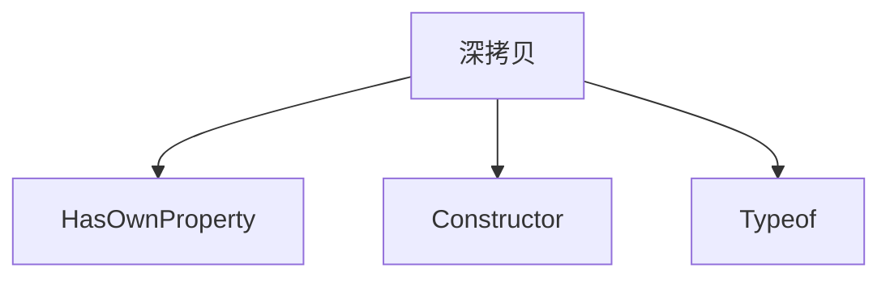

# 深拷贝

深拷贝需要**递归复制**对象里的对象，浅拷贝则只是复制**第一层**，对于对象而言只是创建了引用。

## 递归方法

```javascript
function deepClone(source) {
  if (!source && typeof source !== 'object') {
    throw new Error('error arguments', 'shallowClone')
  }
  const targetObj = source.constructor === Array ? [] : {} // 判断是数组还是对象，创建克隆对象 targetObj

  /*
  constructor 的出现原本就是用来进行对象类型判断的，但是 constructor 属性易变，不可信赖
  */
  for (const key in source) {
    if (source.hasOwnProperty(key)) {
      if (source[key] && typeof source[key] === 'object') {
        targetObj[key] = source[key].constructor === Array ? [] : {}
        targetObj[key] = deepClone(source[key])
      } else {
        targetObj[key] = source[keys]
      }
    }
  }
  return targetObj
}
```

```javascript
export function deepClone(source) {
  if (!source && typeof source !== 'object') {
    throw new Error('error arguments', 'shallowClone')
  }
  const targetObj = source.constructor === Array ? [] : {}

  for (const key of Object.keys(source)) {
    if (source[key] && typeof source[key] === 'object') {
      targetObj[key] = source[key].constructor === Array ? [] : {}
      targetObj[key] = deepClone(source[key])
    } else {
      targetObj[key] = source[key]
    }
  }
  return targetObj
}
```

## 相关知识


