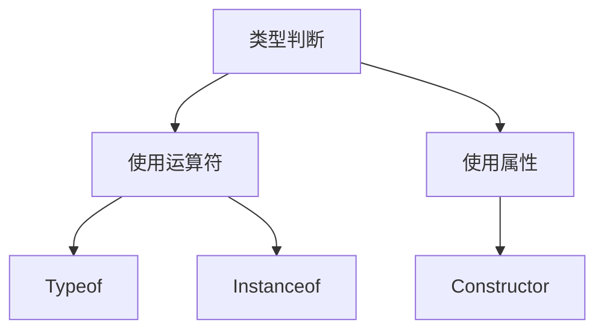
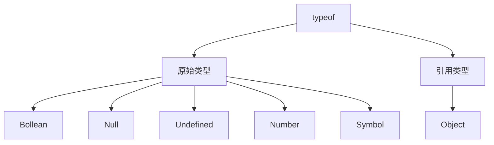

# 类型判断



## 使用 Typeof 运算符

判断 7 种基本数据类型（6 种原始类型和引用类型 Object）

**typeof 无法判断引用的是什么类型**



```javascript
typeof operand
```

## 使用 Constructor 属性

constructor 属性指向对象的构造函数

```javascript
const arr = []
arr.constructor === Array // true

const obj = {}
obj.constructor === Object // true
```

### 局限性

- constructor 在类继承时会出错

## 使用 Instanceof 运算符

instanceof 运算符用来回一个布尔值，用来判断对象是否为某个构造函数的实例。也就是检测 constructor.prototype 是否存在于参数 object 的原型链上。

```javascript
const arr = []
arr instanceof Array //true

const data = new Date()
data instanceof Date //true

const obj = {}
obj instanceof Object //true
```

> 来自 Java

### 局限性

* 无法检测原始类型
* 在类的原型继承中,instanceof 检测出来的结果其实是不准确的

## 使用 toString 方法

找到 Object 原型上的 toString 方法, 让方法执行, 并且让方法中的 this 变为 value

常用来判断对象值属于哪种内置属性，它返回一个 JSON 字符串——"[object 数据类型]"。

```javascript
Object.prototype.toString.call(underfined) // '[object Underfined]'
Object.prototype.toString.call(null) // '[object Null]'
Object.prototype.toString.call('aaa') // '[object String]'
Object.prototype.toString.call(222) // '[object Number]'
Object.prototype.toString.call(true) // '[object Boolean]'
Object.prototype.toString.call({}) // '[object Object]'
Object.prototype.toString.call([]) // '[object Array]'
Object.prototype.toString.call(Map()) // '[object Map]'
Object.prototype.toString.call(Set()) // '[object Set]'
```
