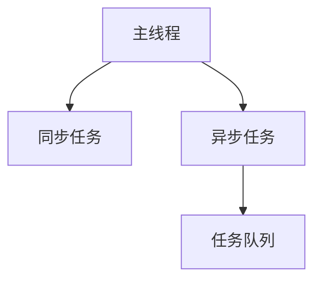

## 同步任务和异步任务

程序里面所有的任务，可以分成两类：同步任务（synchronous）和异步任务（asynchronous）。

同步任务是那些没有被引擎挂起、在主线程上排队执行的任务。只有前一个任务执行完毕，才能执行后一个任务。

异步任务是那些被引擎放在一边，不进入主线程、而进入任务队列的任务。只有引擎认为某个异步任务可以执行了（比如 Ajax 操作从服务器得到了结果），该任务（采用回调函数的形式）才会进入主线程执行。排在异步任务后面的代码，不用等待异步任务结束会马上运行，也就是说，异步任务不具有“堵塞”效应。

## 任务队列和事件循环

JavaScript 运行时，除了一个正在运行的主线程，引擎还提供一个任务队列（task queue），里面是各种需要当前程序处理的异步任务。（实际上，根据异步任务的类型，存在多个任务队列。为了方便理解，这里假设只存在一个队列。）

首先，主线程会去执行所有的同步任务。等到同步任务全部执行完，就会去看任务队列里面的异步任务。如果满足条件，那么异步任务就重新进入主线程开始执行，这时它就变成同步任务了。等到执行完，下一个异步任务再进入主线程开始执行。一旦任务队列清空，程序就结束执行。

异步任务的写法通常是回调函数。一旦异步任务重新进入主线程，就会执行对应的回调函数。如果一个异步任务没有回调函数，就不会进入任务队列，也就是说，不会重新进入主线程，因为没有用回调函数指定下一步的操作。

JavaScript 引擎怎么知道异步任务有没有结果，能不能进入主线程呢？答案就是引擎在不停地检查，一遍又一遍，只要同步任务执行完了，引擎就会去检查那些挂起来的异步任务，是不是可以进入主线程了。这种循环检查的机制，就叫做事件循环（Event Loop）。

> 事件循环是一个程序结构，用于等待和发送消息和事件。

## 异步操作的模式

### 回调函数

回调函数的优点是简单、容易理解和实现，缺点是不利于代码的阅读和维护。

### 事件监听

采用事件驱动模式。异步任务的执行不取决于代码的顺序，而取决于某个事件是否发生。

### 发布/订阅（观察者模式）

事件完全可以理解成“信号”，如果存在一个“信号中心”，某个任务执行完成，就向信号中心“发布”（publish）一个信号，其他任务可以向信号中心“订阅”（subscribe）这个信号，从而知道什么时候自己可以开始执行。

